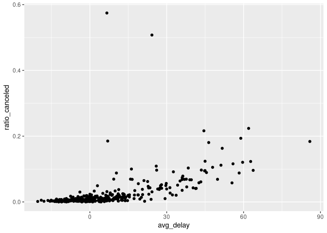

Homework 09/27
================
Tyler J. Anderson

# Introduction

The following homework problems are focussed on the use of dplyr package
to manipulate data frames in the nycflights13 package. The following
setup code is needed to prepare the environment:

``` r
library(dplyr)
```

    ## 
    ## Attaching package: 'dplyr'

    ## The following objects are masked from 'package:stats':
    ## 
    ##     filter, lag

    ## The following objects are masked from 'package:base':
    ## 
    ##     intersect, setdiff, setequal, union

``` r
library(nycflights13)
library(ggplot2)
```

This document lives in a repository that can be pointed to at:

[Github repo homework
folder](https://github.com/tanderso53/stat433_homework/tree/main/hw0927)

# Problem 1

> How many flights have a missing `dep_time`? what other variables are
> missing? What might these rows represent?

``` r
filter(flights, is.na(dep_time)) %>% count()
```

    ## # A tibble: 1 × 1
    ##       n
    ##   <int>
    ## 1  8255

``` r
filter(flights, is.na(dep_time) & !is.na(arr_time)) %>%
    count()
```

    ## # A tibble: 1 × 1
    ##       n
    ##   <int>
    ## 1     0

It appears there are 8255 of these. None of these have an arrival time,
so most likely these flights were canceled or moved to a different
aircraft.

# Problem 2

> Currently dep_time and sched_dep_time are convenient to look at, but
> hard to compute with because they’re not really continuous numbers.
> Convert them to a more convenient representation of number of minutes
> since midnight.

The prompt does not specify what time “midnight” is. As such I will
define midnight as *12:00 AM in the departure airport’s timezone*. This
definition makes the most sense with the context of *dep_time* and
*sched_dep_time*. If the desire was to use these values to compute with
arrival times, more effort will be required.

``` r
# dep_time_msm is the departure time in minutes since midnight
#
# sched_dep_time_msm is the scheduled departure time in minutes since
# midnight
flights %>% mutate(dep_time_msm = (dep_time %/% 100) * 60 + dep_time %% 100,
                   sched_dep_time_msm = (sched_dep_time %/% 100) * 60
                   + sched_dep_time %% 100) %>%
    # Select the rows we are working with to simplify the display.
    # will probably want things like air time, etc, for actual use, but we
    # don't need it now
    select(flight, dep_time, dep_time_msm, sched_dep_time, sched_dep_time_msm)
```

    ## # A tibble: 336,776 × 5
    ##    flight dep_time dep_time_msm sched_dep_time sched_dep_time_msm
    ##     <int>    <int>        <dbl>          <int>              <dbl>
    ##  1   1545      517          317            515                315
    ##  2   1714      533          333            529                329
    ##  3   1141      542          342            540                340
    ##  4    725      544          344            545                345
    ##  5    461      554          354            600                360
    ##  6   1696      554          354            558                358
    ##  7    507      555          355            600                360
    ##  8   5708      557          357            600                360
    ##  9     79      557          357            600                360
    ## 10    301      558          358            600                360
    ## # … with 336,766 more rows

# Problem 3

> Look at the number of canceled flights per day. Is there a pattern? Is
> the proportion of canceled flights related to the average delay? Use
> multiple dyplr (sic) operations, all on one line, concluding with
> `ggplot(aes(x= y=)) + geom_point()`

``` r
flights %>% mutate(canceled = is.na(dep_time)) %>%
    group_by(year, month, day) %>%
    summarise(ratio_canceled = sum(canceled) / n(),
              avg_delay = mean(arr_delay, na.rm = T)) %>%
    ggplot(aes(x = avg_delay, y = ratio_canceled)) + geom_point()
```

    ## `summarise()` has grouped output by 'year', 'month'. You can override using
    ## the `.groups` argument.

<!-- -->

The plot demonstrates a clear pattern: on days with greater avg delay,
there were also a greater number of cancellations. The relationship was
especially strong when the delay is greater than 15 min. There were two
outliers with cancellations greater than 50%, one of which the delay was
less than 15 min average delay. The following will grab some of those
outliers.

``` r
flights %>% mutate(canceled = is.na(dep_time)) %>%
    group_by(year, month, day) %>%
    summarise(ratio_canceled = sum(canceled) / n(),
              avg_delay = mean(arr_delay, na.rm = T)) %>%
    filter(ratio_canceled > 0.5, avg_delay < 30)
```

    ## `summarise()` has grouped output by 'year', 'month'. You can override using
    ## the `.groups` argument.

    ## # A tibble: 2 × 5
    ## # Groups:   year, month [1]
    ##    year month   day ratio_canceled avg_delay
    ##   <int> <int> <int>          <dbl>     <dbl>
    ## 1  2013     2     8          0.508     24.2 
    ## 2  2013     2     9          0.575      6.64

Despite low delay numbers, 2/9 had greater than half the flights
canceled. 2/8 was also well outside the pattern, but had a noticeable
delay average. It may be worth looking at the number of flights
scheduled and the events on those days, but that will be for another
time.
